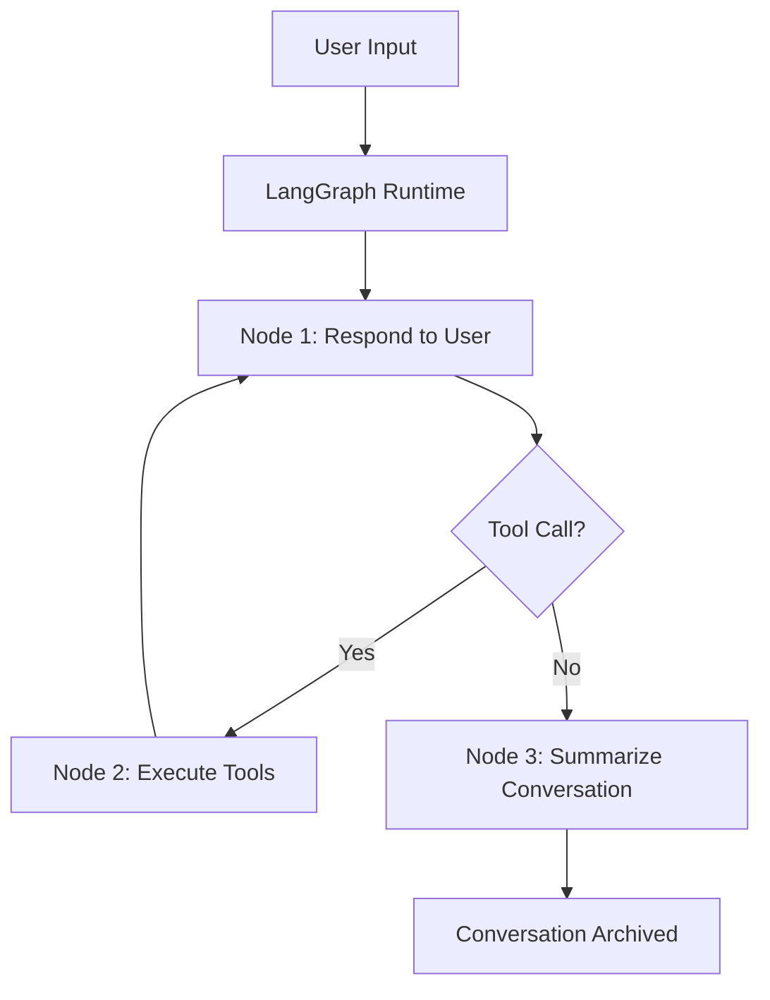
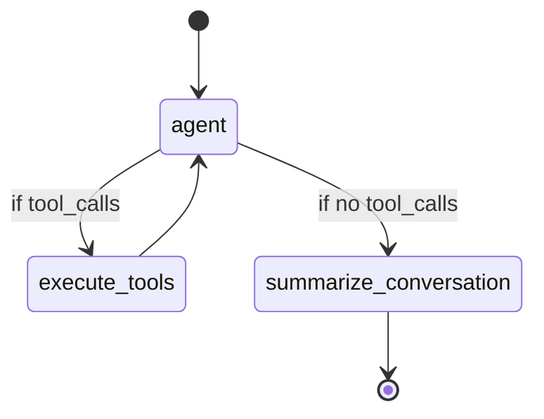

# 🧠 Travel Assistant with Long-Term Memory using LangGraph, Redis, and OpenAI

## ✈️ Project Overview

This project demonstrates a production-grade **AI-powered travel assistant** that:
- **Maintains long-term memory** using Redis + vector embeddings
- **Uses LLM tools** to store, retrieve, and reason over user preferences
- **Manages short-term context** via summarization and LangGraph state graphs
- **Executes actions** like flight planning using LangChain tools
- **Personalizes recommendations** over time using memory recall

This architecture is built for extensibility and production-readiness, leveraging best practices in **LangGraph**, **RedisVL**, **LangChain**, and **OpenAI**.

---

## 🛠 Tech Stack

| Component       | Purpose                                 |
|----------------|------------------------------------------|
| LangGraph       | Workflow orchestration for agent logic   |
| Redis + RedisVL | Vector database for memory storage       |
| LangChain Tools | For memory storing and retrieval         |
| OpenAI API      | LLM for conversations and summarization  |
| Python (3.10+)  | Core development language                |
| Mermaid         | Flowchart rendering in Markdown/GitHub   |

---

## 🧱 System Architecture



- **Node 1: respond_to_user** → LLM responds to user input
- **Node 2: execute_tools** → If LLM decides to call tools (store/retrieve memory), this is triggered
- **Node 3: summarize_conversation** → After N turns, summary is generated to prevent context overflow

---

## 🧠 Memory System

### 📌 Long-Term Memory
Stored in Redis using **vector embeddings** via `OpenAITextVectorizer`. Each memory includes:
- Content
- Metadata (type, user, thread)
- ULID (unique ID)
- Created timestamp

```python
memory_data = {
    "user_id": user_id,
    "content": content,
    "memory_type": memory_type.value,
    "embedding": embedding,
    "created_at": datetime.now().isoformat(),
    "memory_id": str(ulid.ULID()),
}
```

### 🔎 Memory Deduplication

Before storing, we call `similar_memory_exists` using vector similarity search.

```python
vector_query = VectorRangeQuery(
    vector=embedding,
    filter_expression=filters,
    distance_threshold=0.1
)
```

### 📥 store_memory_tool

LLM calls this tool to store knowledge in Redis with memory type and metadata.

### 📤 retrieve_memories_tool

Searches vector DB with filters like memory_type, thread_id, user_id.

---

## 🔁 Conversation Management (LangGraph)

LangGraph is used to define and control the agent's behavior across multiple steps.



---

## 🧠 Short-Term Memory

RedisSaver is used to checkpoint conversation state. The state includes a list of `messages` that evolves through the graph run.

```python
state = RuntimeState(messages=[])
graph = workflow.compile(checkpointer=RedisSaver(url="redis://localhost:6379"))
```

---

## 👨‍💻 Nodes Explained

### 🔹 `respond_to_user`

- Receives input
- Sends it to `travel_agent.invoke`
- Adds response to state

### 🔹 `execute_tools`

- Detects if LLM decided to use a tool
- Executes tool and adds result to conversation

### 🔹 `summarize_conversation`

- Summarizes every 6+ messages to reduce context load
- Retains memory-worthy facts

---

## 💬 Example Run

```text
You: I plan to go to Singapore with my wife. We love outdoors and food.
Assistant: [recommends trip plan + stores memory]
You: I like flying Delta and prefer first class.
Assistant: [Stores preferences in Redis]
You: My wife is allergic to shellfish.
Assistant: [Stores allergy memory]
```

### Retrieved Memories:
```
- User loves outdoor travel and food.
- Prefers Delta and first-class flights.
- Wife is allergic to shellfish.
```

---

## 🚀 How to Run

```bash
git clone https://github.com/yourusername/travel-agent-memory.git
cd travel-agent-memory
pip install -r requirements.txt
python main.py
```

---

## 📈 Future Improvements

- Add real-time flight APIs
- Connect weather tools or Google Maps APIs
- Extend tool memory with vector clustering
- Integrate RAG for knowledge grounding

---

## 👤 Author

**Tanujkumar Mangalapally**  
_Designed with care, memory, and travel in mind._

---

## 📎 License

MIT License.
