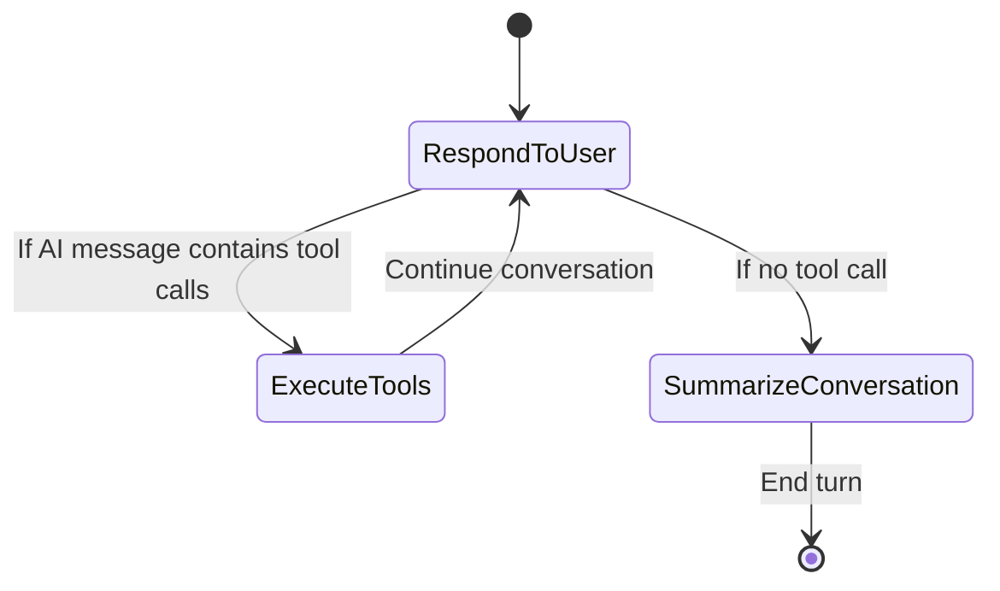
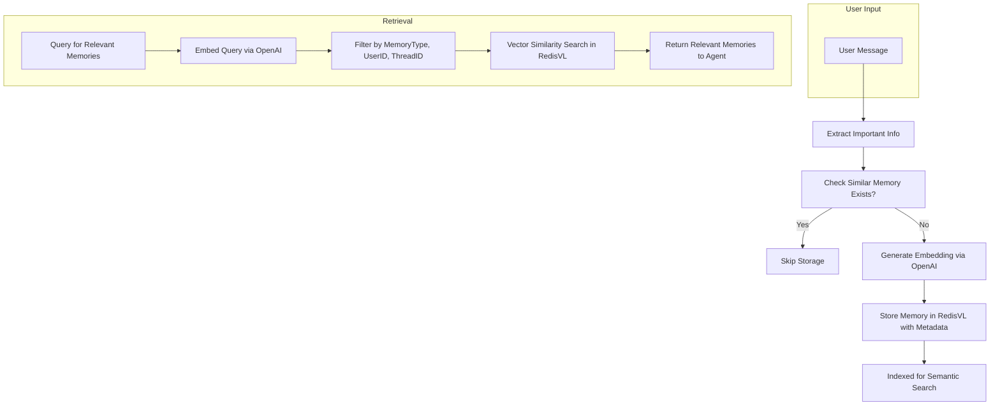
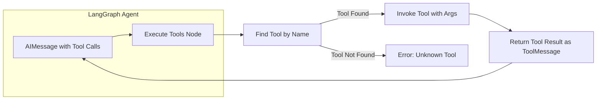

# 🧳 Travel Memory Agent with Long-Term & Short-Term Memory

## 📌 Overview
This project is an **AI-powered Travel Assistant** built using **LangGraph, LangChain, RedisVL, and OpenAI**.  
It features **short-term memory** for conversation context and **long-term memory** to store user preferences, travel history, and constraints for highly personalized travel recommendations.

---

## 🚀 Features
- **ReAct-based LangGraph Agent** with tool execution
- **Short-term memory** via RedisSaver
- **Long-term memory** with RedisVL + OpenAI embeddings
- **Automatic conversation summarization**
- **Memory deduplication** to prevent storing duplicate info
- **Tool-enabled** for booking help, travel recommendations, and memory retrieval
- **Personalized travel suggestions** based on stored preferences

---

## 🛠 Architecture Diagram

```mermaid
flowchart LR
    subgraph User
        U[User Input]
    end

    subgraph LangGraph Agent
        A1[Agent Node: Respond to User]
        A2[Execute Tools Node]
        A3[Summarize Conversation Node]
    end

    subgraph Memory
        STM[Short-Term Memory: RedisSaver]
        LTM[Long-Term Memory: RedisVL + Vector DB]
    end

    subgraph External APIs
        TOOLS[Custom Tools: store_memory, retrieve_memories]
        OPENAI[OpenAI API for LLM + Embeddings]
    end

    U --> A1
    A1 -->|LLM Calls| OPENAI
    A1 -->|Tool Call Decision| A2
    A2 --> TOOLS
    TOOLS --> LTM
    A3 --> STM
    STM <--> LangGraph Agent
    LTM <--> LangGraph Agent
```

---

## 📜 Conversation Workflow in LangGraph



---

## 💾 Memory Storage & Retrieval Flow



---

## 🔧 Tool Execution Flow



---

## 🧩 Key Code Components

### 1️⃣ Checking for Similar Memories
```python
def similar_memory_exists(content, memory_type, user_id, thread_id=None, distance_threshold=0.1):
    content_embedding = openai_embed.embed(content)
    filters = (Tag("user_id") == user_id) & (Tag("memory_type") == memory_type)
    if thread_id:
        filters &= Tag("thread_id") == thread_id

    vector_query = VectorRangeQuery(
        vector=content_embedding,
        num_results=1,
        vector_field_name="embedding",
        filter_expression=filters,
        distance_threshold=distance_threshold,
        return_fields=["id"],
    )
    results = long_term_memory_index.query(vector_query)
    return bool(results)
```

### 2️⃣ Storing a Memory
```python
def store_memory(content, memory_type, user_id, thread_id=None, metadata=None):
    if similar_memory_exists(content, memory_type, user_id, thread_id):
        return
    embedding = openai_embed.embed(content)
    memory_data = {
        "user_id": user_id,
        "content": content,
        "memory_type": memory_type.value,
        "metadata": metadata or "{}",
        "embedding": embedding,
    }
    long_term_memory_index.load([memory_data])
```

### 3️⃣ Retrieving Memories
```python
def retrieve_memories(query, memory_type=None, user_id="system", thread_id=None, distance_threshold=0.1, limit=5):
    vector_query = VectorRangeQuery(
        vector=openai_embed.embed(query),
        return_fields=["content", "memory_type", "metadata"],
        num_results=limit,
        vector_field_name="embedding",
        distance_threshold=distance_threshold,
    )
    results = long_term_memory_index.query(vector_query)
    return results
```

---

## 🏁 How it Works (Step-by-Step)
1. **User sends a travel-related query**
2. **Agent processes the input** → Decides if it needs tools
3. **If tool needed** → Executes `store_memory_tool` or `retrieve_memories_tool`
4. **If no tool needed** → Responds directly
5. **Conversation summarization** every 6 messages to manage context
6. **Long-term memories** stored in RedisVL for personalization

---

## 📌 Tech Stack
- **LangGraph** → Agent workflow
- **LangChain** → LLM integration
- **OpenAI GPT-4o** → LLM + embeddings
- **RedisVL** → Long-term memory vector storage
- **RedisSaver** → Short-term conversation memory
- **Python**

---

## 📜 License
MIT License © 2025

