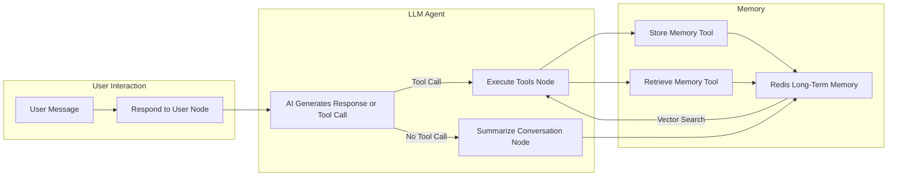

# Travel Assistant with Long-Term & Short-Term Memory

## Overview
This project implements an AI-powered **Travel Assistant** that uses:
- **LangGraph** for orchestrating the ReAct agent
- **Redis** for both **short-term conversation memory** and **long-term semantic/episodic memory**
- **OpenAI embeddings** for semantic search in Redis
- **Tool execution** for storing and retrieving memories dynamically
- **Conversation summarization** to preserve important details while managing LLM context limits

The assistant can:
1. Remember your travel preferences and experiences
2. Retrieve relevant memories in future conversations
3. Recommend personalized activities, routes, and booking suggestions
4. Maintain context across multiple sessions

---

## Architecture

```mermaid
graph TD
    A[User] --> B[Travel Assistant]
    B --> C[LangGraph Workflow]
    C --> D[Redis Short-Term Memory<br>(RedisSaver)]
    C --> E[Redis Long-Term Memory<br>(RedisVL + Vector Embeddings)]
    E -->|Stores & Retrieves| F[Semantic + Episodic Memories]
    C --> G[LLM Agent (ReAct)]
    G --> H[Tool Execution Layer]
    H --> I[Store Memory Tool]
    H --> J[Retrieve Memory Tool]
    J -->|Semantic Search| E
    I -->|Vector Embedding| E
    C --> K[Conversation Summarizer]
    K --> E
```

---

## Workflow



---

## Code Highlights

### 1. **Checking for Similar Memories**
Before storing a new memory, we ensure it’s not already stored.

```python
def similar_memory_exists(content, memory_type, user_id=SYSTEM_USER_ID, thread_id=None, distance_threshold=0.1):
    content_embedding = openai_embed.embed(content)
    filters = (Tag("user_id") == user_id) & (Tag("memory_type") == memory_type)
    if thread_id:
        filters = filters & (Tag("thread_id") == thread_id)

    vector_query = VectorRangeQuery(
        vector=content_embedding,
        num_results=1,
        vector_field_name="embedding",
        filter_expression=filters,
        distance_threshold=distance_threshold,
        return_fields=["id"],
    )
    results = long_term_memory_index.query(vector_query)
    return bool(results)
```

### 2. **Storing Memory**
We store user memories in Redis with embeddings for semantic search.

```python
def store_memory(content, memory_type, user_id=SYSTEM_USER_ID, thread_id=None, metadata=None):
    if similar_memory_exists(content, memory_type, user_id, thread_id):
        return
    embedding = openai_embed.embed(content)
    memory_data = {
        "user_id": user_id,
        "content": content,
        "memory_type": memory_type.value,
        "metadata": metadata or "{}",
        "embedding": embedding,
        "memory_id": str(ulid.ULID()),
        "thread_id": thread_id,
    }
    long_term_memory_index.load([memory_data])
```

### 3. **Retrieving Memories**
Semantic + metadata filtering for relevant past information.

```python
def retrieve_memories(query, memory_type=None, user_id=SYSTEM_USER_ID, thread_id=None, limit=5):
    vector_query = VectorRangeQuery(
        vector=openai_embed.embed(query),
        num_results=limit,
        vector_field_name="embedding",
        distance_threshold=0.3,
    )
    base_filters = [f"@user_id:{{{user_id}}}"]
    if memory_type:
        if isinstance(memory_type, list):
            base_filters.append(f"@memory_type:{{{'|'.join(memory_type)}}}")
        else:
            base_filters.append(f"@memory_type:{{{memory_type.value}}}")
    if thread_id:
        base_filters.append(f"@thread_id:{{{thread_id}}}")
    vector_query.set_filter(" ".join(base_filters))
    return long_term_memory_index.query(vector_query)
```

---

## Example Conversation Flow

1. **User:** "I like Delta Airlines and prefer window seats."
   - Assistant stores this as an **episodic memory**.
   
2. **User:** "Book me a flight to Singapore."
   - Assistant recalls airline preference → suggests Delta routes.

3. **User:** "No shellfish dishes for my wife."
   - Assistant stores dietary restriction as episodic memory.

4. **User:** "Plan a Sunday in Singapore for us."
   - Assistant uses stored preferences for a **personalized itinerary**.

---

## Key Technologies
- **LangGraph** – LLM orchestration
- **RedisVL** – Vector similarity search
- **RedisSaver** – Short-term conversation checkpointing
- **OpenAI** – Embeddings + LLM
- **Python** – Core implementation
- **Mermaid.js** – Diagrams

---

## Installation

```bash
git clone <your-repo-url>
cd <repo-folder>
pip install -r requirements.txt
python main.py
```

---

## License
MIT License

