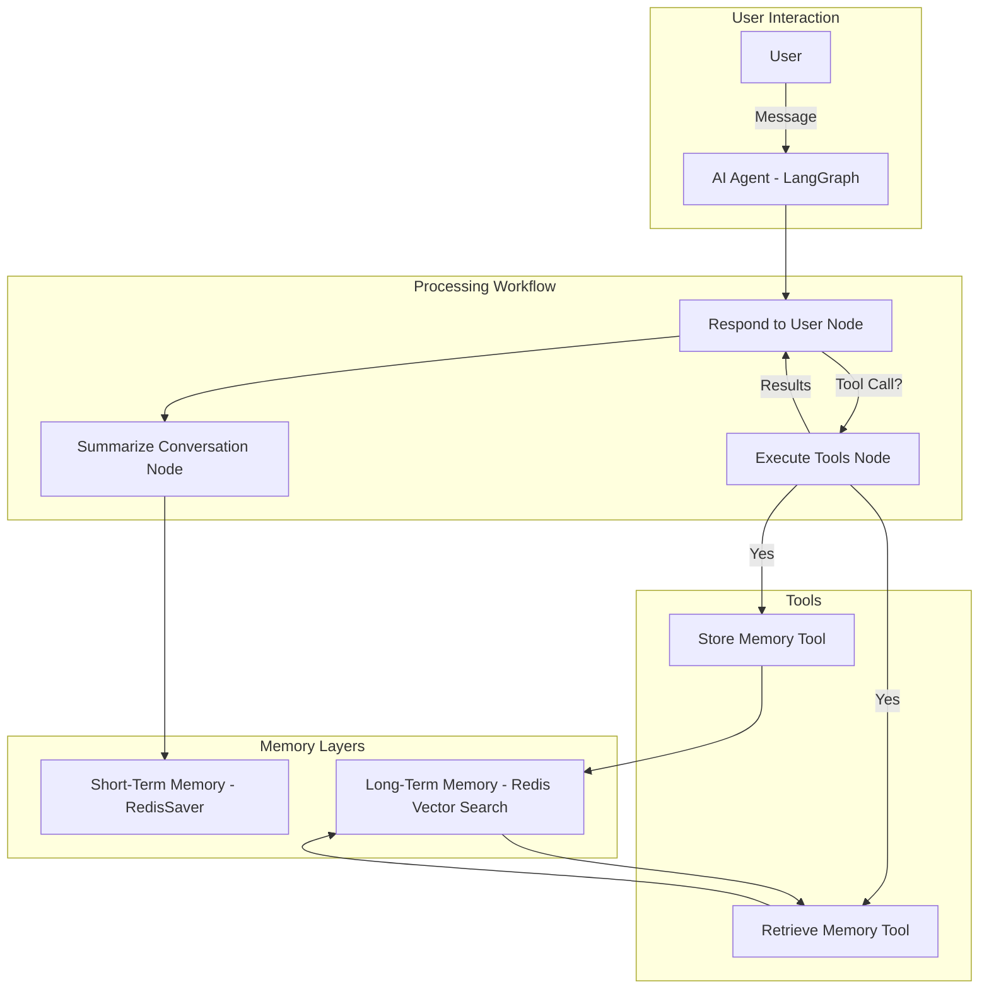

# 🧳 Travel Agent with Short-Term & Long-Term Memory using LangGraph, Redis, and OpenAI

## 📌 Short Description
An intelligent travel assistant that uses **LangGraph**, **Redis**, and **OpenAI** to provide **personalized, memory-aware travel recommendations** by storing **short-term** and **long-term memories** of user preferences, experiences, and important facts.

---

## 📖 Project Overview

This project implements an **AI-powered conversational travel assistant** with **persistent memory**.  
It can:

- Remember **user preferences** (e.g., "prefers Delta Airlines", "no shellfish meals").
- Recall **past trips** and experiences shared in conversation.
- Suggest **personalized travel recommendations**.
- Store and retrieve **episodic** (personal experience) and **semantic** (general fact) memories.
- Summarize conversations to manage context while keeping relevant details.

It uses **LangGraph** to orchestrate the agent workflow, **Redis** for both **short-term** and **long-term memory**, and **OpenAI** for embeddings & LLM responses.

---

## 🚀 Features
- 🧠 **Persistent Memory**: Retains knowledge across sessions.
- 🎯 **Personalization**: Tailors recommendations based on stored memories.
- 🔍 **Semantic Search**: Finds related memories via vector similarity.
- 🛠 **Tool Integration**: AI can call tools to store/retrieve memories dynamically.
- 📝 **Automatic Summarization**: Keeps conversation context concise.
- 🔄 **Memory Deduplication**: Avoids duplicate memory entries.

---

## 🏗 System Architecture

